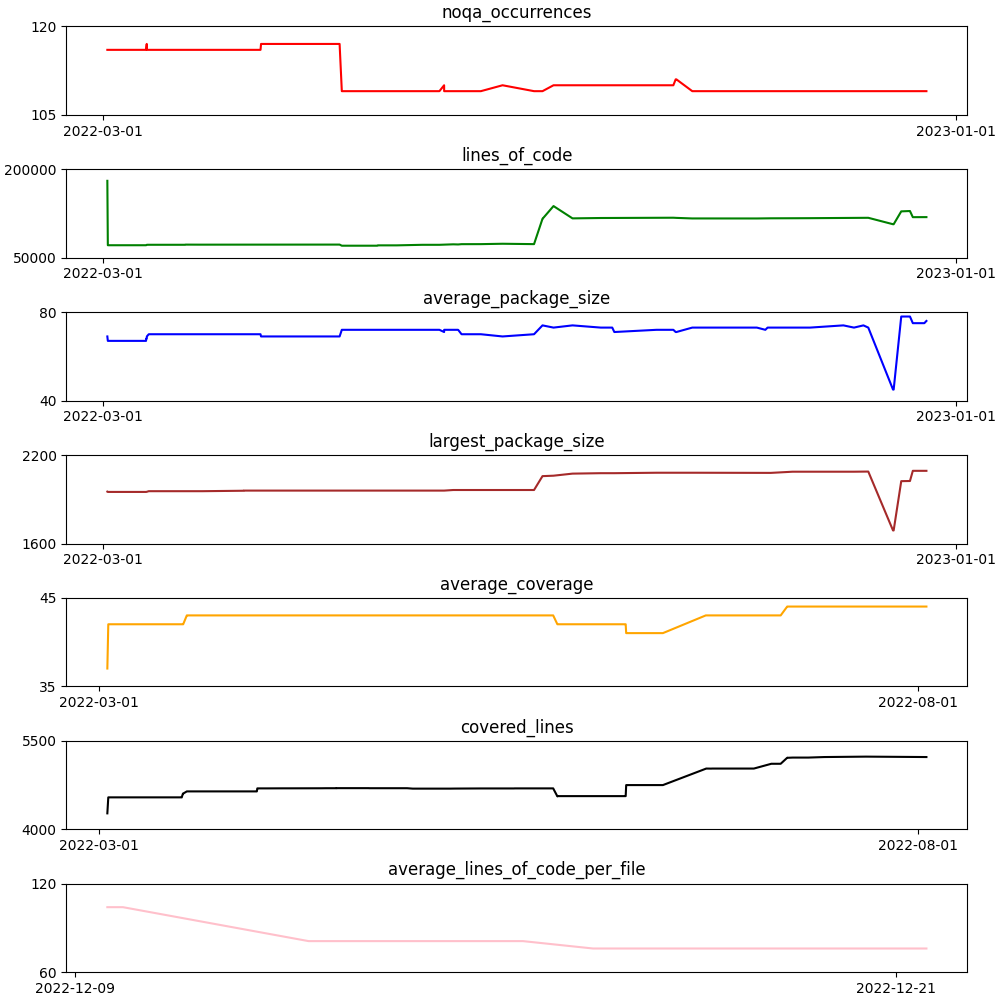
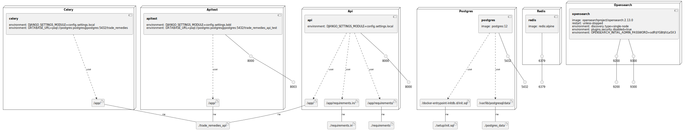

# Trade Remedies API

API Service for the Trade Remedies Service, a trade dispute case management
system. This service is a Django Rest Framework based application and
provides endpoints to support an internally facing "Caseworker" portal
for DIT Investigators and a customer facing "Public" portal for organisation
members and their collaborators.

## Getting started
Copy `local.env.example` to `local.env`. Most of the settings work out of
the box, however you will need to ask a live services team colleague for `S3`,
`AV`, `GOV Notify` and `Companies House` keys (alternatively refer to the
`dev` PaaS environment setup in `Vault`).

All other local setup and usage should be performed using the [TRS Orchestration Project](https://github.com/uktrade/trade-remedies-docker),
clone the repo and follow the `README` instructions to get instances of the
API, Caseworker and Public services running locally.

## Interacting with Django
Most interactions can be performed using the `makefile` targets described in 
the [TRS Orchestration Project](https://github.com/uktrade/trade-remedies-docker).

Alternatively, in the [orchestration project repo](https://github.com/uktrade/trade-remedies-docker):

    make bash service=api
    ./manage.py

will list all the management commands available. Some pertinent ones are 
listed below. 

### Organisation branding
"Branding" is orchestrated through the environment variables `ORGANISATION_NAME`
and `ORGANISATION_INITIALISM`. However, some database objects also need to
be updated to reflect any new branding. Use the following commands to complete
rebranding:

    python manage.py rebrand_organisation

Revert to old branding (defined _in_ the management command):

    python manage.py rebrand_organisation --revert

## Testing
Tests (including BDD testing) should be invoked from the
[orchestration project repo](https://github.com/uktrade/trade-remedies-docker).

## Fitness Functions

### Infrastructure model

- [api component model](.infragenie/api_component_model.svg)

---
